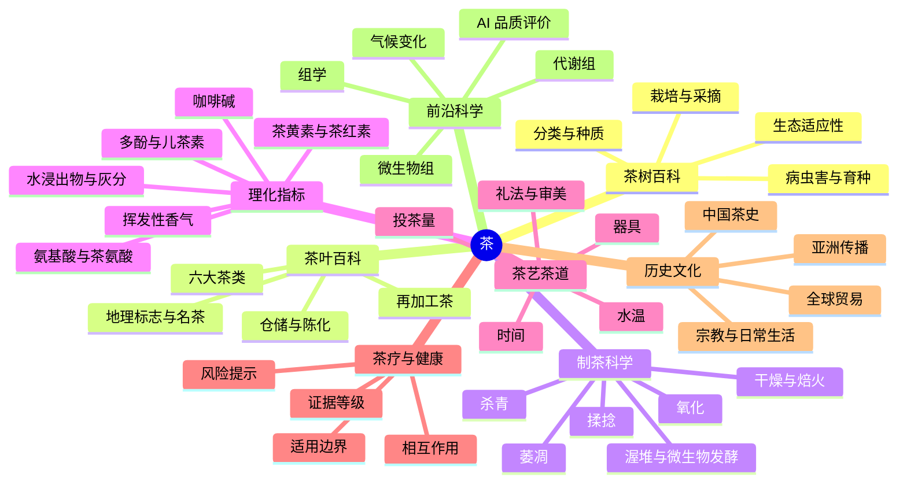

# Tea Knowledge Topology

一个面向 GitHub Pages 与开放协作的「茶」知识项目：用图文、数据、引用和持续研发看板，把茶叶、茶树、茶艺、茶道、茶疗、理化指标、适应性、历史、产业和前沿科学连接成一张可迭代的知识拓扑网络。

> 当前版本：`v0.2.0-alpha`
>
> 状态：项目骨架、一级知识拓扑、TEA-CODE 茶向量体系草案、17 条样例数据、研发看板与 GitHub Pages 自动化已建立。

## 快速入口

- 可视化首页：[site/index.html](site/index.html)
- GitHub Pages 工作流：[.github/workflows/pages.yml](.github/workflows/pages.yml)
- 知识拓扑：[docs/topology.md](docs/topology.md)
- 新茶体系 TEA-CODE：[docs/tea-system.md](docs/tea-system.md)
- 研发工作界面：[docs/workbench.md](docs/workbench.md)
- 资料来源与证据分级：[docs/research-sources.md](docs/research-sources.md)
- 茶向量 schema：[data/tea-vector-schema.json](data/tea-vector-schema.json)
- 样例茶向量数据：[data/example-teas.csv](data/example-teas.csv)

## GitHub Pages 发布

项目内置 GitHub Actions 工作流，会在推送到 `main` 或手动触发时：

1. 校验 `data/example-teas.csv` 中的 TEA-CODE 分值。
2. 将 `site/`、`docs/`、`data/` 和 `README.md` 打包到 `_site/`。
3. 使用 GitHub Pages artifact 部署网站。

仓库需要在 Settings -> Pages 中将 Build and deployment 的 Source 选择为 `GitHub Actions`。本项目的工作流只负责校验数据、构建 `_site`、上传 Pages artifact 并部署；不再尝试在 workflow 内自动创建 Pages site，因为 GitHub 可能返回 `Resource not accessible by integration`。发布成功后，网站通常可通过 `https://hecosysu.github.io/tea_vector/` 访问。

## 项目目标

1. 建立一个尽量不遗漏的茶知识拓扑网络，覆盖从茶树生物学到茶文化、从制茶工艺到理化指标、从健康证据到产业与前沿科学的主要问题域。
2. 将知识整理成适合 GitHub 协作的文档、数据表、图谱、议题库和路线图。
3. 提出并持续迭代一个新的「茶体系」：用可解释的理化与工艺维度，对每一种茶形成向量化编码。
4. 让体系保持「活知识」状态：每条结论尽量带来源、置信度、更新时间和待验证问题。

## 一级知识拓扑

## 图文展示原则

- 图：Mermaid 拓扑、流程图、向量雷达图、工艺时间线、证据矩阵。
- 文：每个专题都保持「定义 -> 关键变量 -> 机制 -> 例子 -> 争议 -> 证据来源 -> 待更新」结构。
- 数据：把茶样、指标、来源和置信度分离，后续可导入知识图谱或向量数据库。

## TEA-CODE 茶向量体系概览

`TEA-CODE` 暂定为 16 维，采用 `0-10` 归一评分，核心思想是用「可测理化特征 + 工艺状态 + 生态来源 + 感官结果」共同描述一种茶：

`[嫩度, 叶型, 氧化度, 微生物发酵度, 焙火度, 陈化度, 多酚强度, 儿茶素保留, 茶黄素茶红素, 游离氨基酸, 咖啡碱, 香气挥发度, 水浸出物, 矿物灰分, 苦涩强度, 鲜爽甜醇]`

详见：[docs/tea-system.md](docs/tea-system.md)。

## 证据与安全

茶的健康相关内容必须区分：

- 日常饮用茶汤
- 高浓度提取物
- 药品或保健品宣称
- 人群差异与药物相互作用

NCCIH 2025 年资料指出，绿茶作为饮品对成年人通常未报告安全问题，但绿茶提取物可能带来胃肠反应、血压变化、肝损伤风险和药物相互作用；多数健康用途尚不能得出确定结论。项目内健康内容不得替代医疗建议。

## 近期任务

- [x] 创建项目结构
- [x] 建立一级知识拓扑
- [x] 提出 TEA-CODE `v0.1`
- [x] 建立研发工作界面
- [ ] 为每个一级主题补 5-10 个权威来源
- [ ] 为 30 种代表性茶建立样例向量
- [x] 将样例茶向量扩展到 17 种代表性茶
- [ ] 建立图片与版权素材清单
- [x] 加入自动校验脚本和 GitHub Actions
- [x] 修复 `configure-pages` 首次部署时 Pages 未启用导致的 Not Found 报错
- [ ] 发布 GitHub Pages 并记录线上访问地址

## 主要参考入口

- NIH NCCIH: Green Tea, last updated February 2025, https://www.nccih.nih.gov/health/green-tea
- ISO 3103:1980: Tea preparation for sensory tests, https://www.iso.org/standard/8250.html
- Kew Plants of the World Online: Camellia sinensis, https://powo.science.kew.org/
- FAOSTAT, crops and livestock products database, https://www.fao.org/faostat/
- Cochrane Review: Green tea for the prevention of cancer, linked from NCCIH key references

## 协作方式

每次新增内容建议同时更新：

1. 对应专题文档。
2. `docs/workbench.md` 的进展与问题。
3. `data/` 中的结构化记录。
4. 资料来源、证据等级与更新时间。
