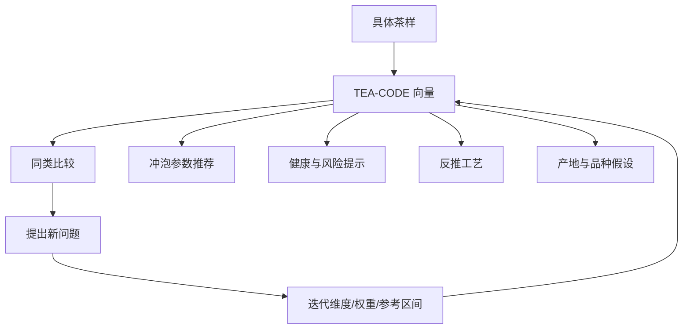

# TEA-CODE：一个可迭代的茶理化编码体系

`TEA-CODE` 是本项目提出的茶向量体系。目标不是取代传统六大茶类，而是提供一个更细的解释工具：当我们说「这是什么茶、为什么这样香、为什么适合这样泡、为什么可能不适合某些人」时，可以回到一组可讨论、可测量、可迭代的变量。

## 设计原则

1. 可解释：每一维都能对应工艺、理化或感官机制。
2. 可测优先：能用检测数据支持的维度优先；不能检测时才使用专家估计。
3. 版本化：体系本身要允许更新，不把 `v0.1` 当作终局。
4. 分层：把「原料状态」「工艺状态」「化学状态」「感官状态」分开。
5. 诚实：每条向量必须带 `confidence` 和 `basis`，说明来自实验、文献、标准、专家估计还是样品实测。

## v0.1 向量维度

所有维度先统一映射到 `0-10`，但原始单位应在未来数据表中保留。

| 代码 | 维度 | 0 代表 | 10 代表 | 推荐依据 |
| --- | --- | --- | --- | --- |
| T01 | 嫩度 | 粗老叶梗 | 单芽/一芽一叶 | 采摘标准、叶底 |
| T02 | 叶型完整度 | 粉末/碎片 | 完整芽叶 | 外形、筛分 |
| P01 | 氧化度 | 基本未氧化 | 充分酶促氧化 | 工艺、儿茶素/茶黄素谱 |
| P02 | 微生物发酵度 | 无 | 强渥堆/长期后发酵 | 微生物、茶褐素、仓储 |
| P03 | 焙火度 | 无焙火 | 高火/足火 | 工艺、香气、含水 |
| P04 | 陈化度 | 新茶 | 长期陈化 | 年份、仓储、风味 |
| C01 | 多酚强度 | 很低 | 很高 | 总多酚 |
| C02 | 儿茶素保留 | 很低 | 很高 | EGCG/EGC/ECG/EC |
| C03 | 氧化聚合物 | 很低 | 很高 | 茶黄素、茶红素、茶褐素 |
| C04 | 游离氨基酸 | 很低 | 很高 | 氨基酸总量、茶氨酸 |
| C05 | 咖啡碱 | 很低 | 很高 | 咖啡碱含量 |
| C06 | 香气挥发度 | 平淡 | 高香 | GC-MS/感官 |
| C07 | 水浸出物 | 很低 | 很高 | 水浸出物 |
| C08 | 矿物灰分 | 很低 | 很高 | 总灰分、元素谱 |
| S01 | 苦涩强度 | 柔和 | 强苦强涩 | 感官、儿茶素/咖啡碱 |
| S02 | 鲜爽甜醇 | 薄/粗 | 鲜、甜、醇厚 | 感官、氨基酸/糖/浸出物 |

## 计算建议

### 直接测量维度

如果有实验数据，优先使用原始值并做批次内归一化：

```text
score = clamp(10 * (value - lower_ref) / (upper_ref - lower_ref), 0, 10)
```

`lower_ref` 与 `upper_ref` 不应随意拍脑袋。第一阶段可按茶类和公开文献范围建立参考区间，第二阶段改成按样品库分位数动态更新。

### 推断维度

当没有实验数据时，可以使用规则推断，但必须降低置信度：

- 绿茶：`P01` 通常低，`C02` 通常较高。
- 红茶：`P01` 高，`C03` 高，`C02` 下降。
- 乌龙茶：`P01` 中间但跨度大，`P03` 可从清香到足火。
- 黑茶/熟普：`P02` 高，`P04` 可能高，`C03` 高。
- 白茶：`P01` 低到中低，`P04` 可随年份增加。
- 黄茶：`P01` 低到中低，受闷黄影响。

## 编码示例

```text
龙井 2025 明前一级:
[9, 8, 1, 0, 1, 0, 7, 8, 1, 8, 5, 6, 7, 4, 4, 8]

武夷岩茶 肉桂 中足火:
[4, 7, 5, 0, 7, 2, 6, 4, 5, 4, 5, 8, 7, 5, 5, 7]

熟普 2018 勐海:
[3, 6, 3, 8, 2, 6, 4, 2, 8, 3, 4, 5, 8, 6, 3, 8]
```

这些样例是体系演示，不等于具体商品检测结论。

## 与知识拓扑融合



## 重点解释场景

1. 为什么绿茶更强调低温快泡？
   高儿茶素保留和较高鲜爽维度意味着过高温长时间可能放大苦涩。

2. 为什么红茶汤色红亮、滋味甜醇？
   酶促氧化让部分儿茶素转化为茶黄素、茶红素等氧化聚合物，同时影响色泽、收敛和醇厚。

3. 为什么同为乌龙差异巨大？
   乌龙横跨氧化度、焙火度和香气挥发度多个维度，从清香型到岩茶足火型不是一个单轴分类能解释的。

4. 为什么老白茶、普洱需要仓储变量？
   年份本身不等于品质，仓储温湿度、氧气、微生物和原料基础共同决定陈化方向。

## 待深化问题

- 是否需要为「香气」拆出花香、果香、焙烤香、陈香、青气、烟气等子维度？
- 是否应把安全指标纳入主向量，还是作为独立的合规层？
- 不同茶类是否需要不同参考区间，避免绿茶和黑茶在同一尺度上误判？
- 如何将感官审评标准与仪器指标相互校准？
- 如何处理冲泡参数对茶汤化学结果的影响？

## 版本路线

- `v0.1`：16 维框架，样例数据，人工估计。
- `v0.2`：加入原始单位、参考区间、数据来源和置信度。
- `v0.3`：加入雷达图生成、茶类聚类和相似茶检索。
- `v0.4`：引入感官审评表与冲泡曲线。
- `v1.0`：形成公开样品库、检测方法说明和可复现实验流程。

