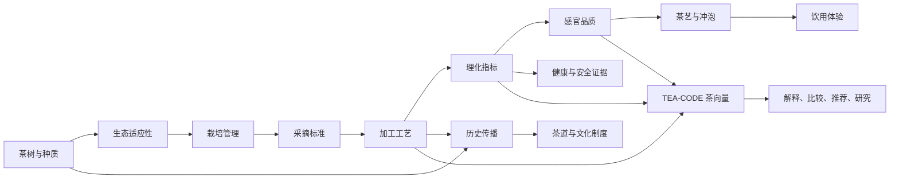
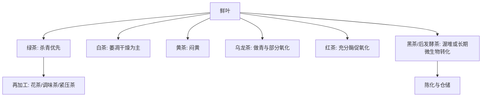
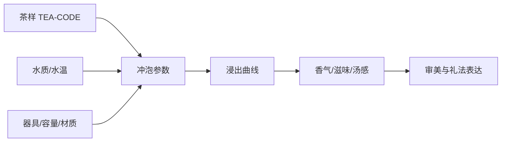

# 茶知识拓扑网络 v0.1

本文件是项目的知识地图。它不是百科条目的堆叠，而是把「茶」拆成可以互相解释的节点与边：植物决定原料潜能，生态与栽培改变代谢物，采摘和加工改变理化状态，理化状态再影响感官、冲泡、健康证据、文化实践和产业价值。

## 总览图

## 1. 茶树百科

核心对象是茶树 `Camellia sinensis` 及其变种、栽培品种和近缘可制茶植物。Kew Plants of the World Online 可作为拉丁名、分布和分类学核对入口；常见生产讨论中还会区分小叶种 `var. sinensis`、大叶种 `var. assamica` 以及地方群体种、无性系品种。

关键节点：

- 分类：科属、种、变种、品种、地方群体、无性系。
- 形态：芽、叶、枝、花、果、根系。
- 生理：光合、休眠、萌芽轮次、次生代谢。
- 生态：纬度、海拔、温度、降雨、土壤 pH、云雾、遮阴。
- 育种：高香、高氨基酸、高儿茶素、抗寒、抗旱、抗病虫。

## 2. 茶叶百科

茶叶不是由茶树品种单独决定，而是「原料 + 工艺 + 产区 + 仓储」共同形成。

主要分类维度：

- 工艺茶类：绿、白、黄、乌龙、红、黑。
- 形态：散茶、紧压茶、粉茶、碎茶、袋泡茶。
- 产地：西湖龙井、武夷岩茶、安溪铁观音、祁门红茶、普洱茶、福鼎白茶等。
- 商品等级：采摘嫩度、筛分等级、外形、香气、滋味、汤色、叶底。
- 再加工：茉莉花茶、抹茶、玄米茶、调饮茶、冷萃茶。

## 3. 制茶科学

加工是茶知识拓扑中的「状态转换器」。同一棵茶树的鲜叶，可以因为加工路径不同而进入完全不同的理化与感官空间。

| 工序 | 主要目的 | 影响的关键指标 |
| --- | --- | --- |
| 萎凋 | 失水、软化、启动部分代谢 | 含水率、香气前体、氨基酸 |
| 杀青 | 失活氧化酶，固定绿茶方向 | 儿茶素保留、青草气、色泽 |
| 揉捻/做形 | 破碎细胞、塑形、利于浸出 | 汤感、条索、氧化速度 |
| 做青 | 交替摇青与静置，形成乌龙香 | 花果香、部分氧化 |
| 酶促氧化 | 儿茶素向茶黄素、茶红素转化 | 汤色、鲜爽、醇厚、收敛 |
| 闷黄 | 湿热环境下非典型轻转化 | 黄汤黄叶、甜醇 |
| 渥堆 | 微生物参与的后发酵 | 茶褐素、陈香、堆味风险 |
| 焙火 | 降水、稳定品质、形成焙香 | 焦糖、坚果、火功 |
| 仓储 | 氧气、水分、微生物长期作用 | 陈化度、香气谱、安全风险 |

## 4. 理化指标

理化指标是新茶体系的骨架。第一阶段建议优先采集这些变量：

- 水分：影响稳定性、霉变风险和仓储。
- 水浸出物：反映可溶性物质总量。
- 茶多酚：涩感、抗氧化活性和后续氧化底物。
- 儿茶素谱：EGCG、EGC、ECG、EC、C、GC 等。
- 茶黄素/茶红素/茶褐素：红茶、黑茶汤色和滋味的关键解释变量。
- 游离氨基酸与茶氨酸：鲜爽、甜感、遮阴栽培和嫩度相关。
- 咖啡碱：苦味、刺激性、提神作用。
- 可溶性糖：甜醇、焙火反应底物。
- 挥发性香气：萜烯、醇、醛、酯、内酯、吡嗪等。
- 灰分与矿物元素：品质、土壤、食品安全与标准检验。
- 农残、重金属、真菌毒素：安全底线指标。

## 5. 茶艺与茶道

茶艺是可重复的冲泡技术系统，茶道是审美、伦理、礼法和身心修养系统。两者都需要接回理化：水温、时间、投茶量、器具材质和水质，本质上改变的是浸出动力学与感官呈现。

## 6. 茶疗与健康

项目采用「谨慎证据」原则。茶可以作为饮食文化、日常饮品和研究对象讨论，但健康内容必须标注证据等级和适用范围。

健康节点：

- 有相对明确机制但临床结论需谨慎：咖啡碱提神、茶氨酸与放松/注意力、儿茶素抗氧化活性。
- 证据不稳定或效应较小：体重、血脂、心血管风险、糖代谢、肠道菌群。
- 必须提示风险：浓缩绿茶提取物的肝损伤报告、咖啡因敏感、孕期咖啡因、铁吸收、药物相互作用。

## 7. 历史文化

茶史应避免单线叙事，至少包含：

- 中国西南与东亚栽培起源问题。
- 唐宋明清饮茶方式变化：煎茶、点茶、泡茶。
- 茶马互市、丝路、海贸、殖民种植园。
- 日本茶道、韩国茶礼、英国下午茶、南亚奶茶、中亚砖茶。
- 当代茶空间：茶馆、新式茶饮、精品茶、茶旅融合。

## 8. 前沿科学

优先跟踪这些研究方向：

- 茶树基因组、泛基因组与种质资源。
- 代谢组学解释香气、滋味和工艺转化。
- 微生物组解释普洱、黑茶、康普茶与仓储。
- 高光谱、电子鼻/电子舌、机器视觉与 AI 分级。
- 气候变化对茶树适应性、品质和产区迁移的影响。
- 茶多酚、茶氨酸、咖啡碱在人体中的吸收、代谢与人群差异。

## 9. 未覆盖清单

下一轮需要继续补齐：

- 各国茶叶标准与食品安全法规。
- 中国国家标准、地理标志和地方标准清单。
- 代表性产区的生态数据。
- 茶器材料学：瓷、陶、紫砂、玻璃、金属。
- 宗教与哲学文本中的茶。
- 新式茶饮、供应链、碳足迹与公平贸易。

